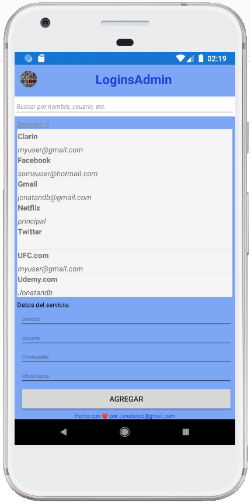

# LoginsAdmin (Xamarin)
Repositorio de LoginsAdmin para la versión para Android hecha con Xamarin.Forms

### Guías utilizadas:

 - <a href="https://docs.microsoft.com/es-es/learn/modules/create-a-mobile-app-with-xamarin-forms/2-create-a-xf-project-in-vs" target="_blank">Creación de un proyecto de Xamarin.Forms en Visual Studio</a>

 - <a href="https://docs.microsoft.com/es-es/learn/modules/store-local-data-with-sqlite/" target="_blank">Almacenamiento de datos locales con SQLite en una aplicación de Xamarin.Forms</a>

 - <a href="https://docs.microsoft.com/es-es/xamarin/android/user-interface/splash-screen" target="_blank">Pantalla de presentación</a>
 
 - <a href="https://docs.microsoft.com/es-es/learn/modules/create-multi-page-xamarin-forms-apps-with-stack-and-tab-navigation/" target="_blank">Creación de aplicaciones de Xamarin.Forms de varias páginas con navegación de pila y pestaña</a>
 
 - <a href="https://docs.microsoft.com/es-es/samples/xamarin/xamarin-forms-samples/navigation-loginflow/" target="_blank">Xamarin.Forms - LoginFlow</a>

