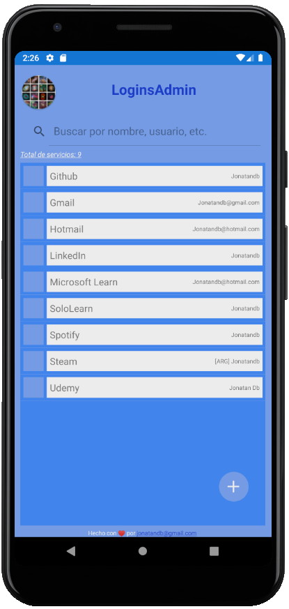

# LoginsAdmin (Xamarin)

Repositorio de LoginsAdmin para la versión para Android (hecha con Xamarin.Forms)

---

## Última versión:
- v0.6-alpha: <a href="https://github.com/Jonatandb/LoginsAdmin-Xamarin-/releases/tag/v0.6-alpha">Rediseño general para adaptación a múltiples pantallas y tamaños de fuente</a>

---	

### Pendientes y "Nice to have":

    - Corregir:
        - Mejorar el ordenamiento de la grilla principal para que tome por igual mayúsculas y minúsculas y no ordene primero servicios en mayúsculas y luego los que están en minúsculas.
        - Centrar la contraseña a medida que es ingresada
            - https://forums.xamarin.com/discussion/42438/align-center-text-entry
            - https://stackoverflow.com/questions/50763662/center-text-in-xamarin-entry
        - Cuando se presiona el botón continuar más de una vez, la app no vuelve a pedir la contraseña al volver del segundo plano

    - Posibles agregados:
        - Refactorizar login para agregar ViewModel
	    - Exportación/Importación de datos
            -   Que se soliciten las credenciales para algún servicio de almacenamiento online (DropBox, Drive, etc) y se guarde ahí un archivo con los datos de los servicios
            -   Que se genere y descargue un archivo XLS con contraseña: la utilizada para acceder a la aplicación.
                -   Contra: desde el celular no lo podrían abrir sin tener instalado Office.
            -   Que se genere y descargue un archivo .Zip con contraseña: la utilizada para acceder a la aplicación.
                -   Adentro podría tener un simple archivo txt, json, xls...
                -   Contra: desde el celular no lo podrían abrir y revisar ya que no se pueden abrir archivos .zip
	    - Que se pueda configurar:
            - Que se pueda elegir que la busqueda respete mayusculas
		    - Reestablecer scroll de la grilla al agregar un servicio
		    - Si al estar creando un servicio se hace back y había algo escrito que se pida confirmación
		    - Que se pida confirmación al eliminar un servicio
	    - Que aparezca una imagen junto a cada fila con el favicon del servicio (si el mismo contiene una url)
            - https://www.google.com/s2/favicons?domain=www.google.com
	    - Cuando no exista el servicio buscado: Hacer aparecer texto clickeable que diga "Click aquí para crear el servicio + SearchText"
	    - Iconos juntos a los campos del ABM que permitan copiar al portapapeles los valores de tales campos
		    - https://docs.microsoft.com/en-us/xamarin/essentials/clipboard

    - Sugerencias recibidas:
        - Agregar opción que permita guardar contraseñas anteriores

---

### Páginas consultadas:

 - <a href="https://docs.microsoft.com/es-es/learn/modules/create-a-mobile-app-with-xamarin-forms/2-create-a-xf-project-in-vs" target="_blank">Creación de un proyecto de Xamarin.Forms en Visual Studio</a>

 - <a href="https://docs.microsoft.com/es-es/learn/modules/store-local-data-with-sqlite/" target="_blank">Almacenamiento de datos locales con SQLite en una aplicación de Xamarin.Forms</a>

 - <a href="https://docs.microsoft.com/es-es/xamarin/android/user-interface/splash-screen" target="_blank">Pantalla de presentación</a>
 
 - <a href="https://docs.microsoft.com/es-es/learn/modules/create-multi-page-xamarin-forms-apps-with-stack-and-tab-navigation/" target="_blank">Creación de aplicaciones de Xamarin.Forms de varias páginas con navegación de pila y pestaña</a>
 
 - <a href="https://docs.microsoft.com/es-es/samples/xamarin/xamarin-forms-samples/navigation-loginflow/" target="_blank">Xamarin.Forms - LoginFlow</a>

 - <a href="https://channel9.msdn.com/Series/Xamarin-101" target="_blank">Xamarin Tutorial 101</a>

 - <a href="https://docs.microsoft.com/es-es/xamarin/xamarin-forms/user-interface/searchbar" target="_blank">SearchBar de Xamarin.Forms</a>

 - <a href="https://stackoverflow.com/questions/54517874/how-to-make-a-floating-action-button-in-xamarin-forms" target="_blank">Ícono flotante (FAB: Floating action button)</a>

 - <a href="https://favicon.io/favicon-generator/" target="_blank">Favicon generator</a>

 - <a href="https://docs.microsoft.com/es-es/xamarin/xamarin-forms/user-interface/layouts/absolute-layout" target="_blank">Xamarin.Forms AbsoluteLayout</a>

 - <a href="https://docs.microsoft.com/es-es/xamarin/xamarin-forms/app-fundamentals/data-binding/commanding#using-command-parameters" target="_blank">La interfaz de comandos de Xamarin.Forms</a>

 - <a href="https://geeks.ms/etomas/2011/09/17/c-5-async-await/" target="_blank">C# 5: Async / Await</a>

 - <a href="https://stackoverflow.com/questions/46332349/xamarin-button-command-inside-of-listview-itemtemplate-not-firing" target="_blank">Xamarin Button Command (inside of ListView.ItemTemplate) Not Firing</a>

 - <a href="https://docs.microsoft.com/es-es/xamarin/xamarin-forms/user-interface/layouts/stack-layout">Xamarin.Forms StackLayout</a>
 
 - <a href="https://docs.microsoft.com/es-es/xamarin/xamarin-forms/user-interface/webview?tabs=windows">Xamarin.Forms WebView</a>
 
 - <a href="https://docs.microsoft.com/es-es/learn/modules/display-collections-in-xamarin-forms-apps-with-listview/">Representación de colecciones en aplicaciones de Xamarin.Forms con ListView</a>
 
 - <a href="https://docs.microsoft.com/es-es/xamarin/xamarin-forms/app-fundamentals/custom-renderer/viewcell">Personalización de ViewCell</a>
 
 - <a href="https://docs.microsoft.com/en-us/dotnet/api/xamarin.forms.viewcell?view=xamarin-forms">ViewCell Class</a>
 
 - <a href="https://docs.microsoft.com/en-us/dotnet/api/xamarin.forms.cell?view=xamarin-forms">Cell Class</a>

 - <a href="https://docs.microsoft.com/es-es/xamarin/get-started/tutorials/pop-ups/?tabs=vswin">Tutorial sobre los elementos emergentes de Xamarin.Forms</a>

 - <a href="https://xamarinhelp.com/hyperlink-in-xamarin-forms-label/" target="_blank">Hyperlink in Xamarin.Forms Label</a>

 - <a href="https://xamarinhelp.com/xamarin-forms-user-control/" target="_blank">Xamarin Forms User Control</a>

 - <a href="https://css-tricks.com/snippets/html/mailto-links/" target="_blank">Mailto Links</a>

 - <a href="https://docs.microsoft.com/es-es/xamarin/get-started/tutorials/app-lifecycle/?tabs=vswin" target="_blank">Tutorial sobre el ciclo de vida de las aplicaciones de Xamarin.Forms</a>

 - <a href="https://docs.microsoft.com/es-es/xamarin/get-started/tutorials/label/?tabs=vswin">Tutorial sobre las etiquetas de Xamarin.Forms</a>

 - <a href="https://docs.microsoft.com/es-es/xamarin/get-started/tutorials/stacklayout/?tabs=vswin">Tutorial sobre el diseño de pila de Xamarin.Forms</a>

 - <a href="https://docs.microsoft.com/es-es/xamarin/xamarin-forms/user-interface/layouts/margin-and-padding">Margen y relleno</a>

 - <a href="https://docs.microsoft.com/es-es/xamarin/xamarin-forms/user-interface/layouts/layout-options">Opciones de diseño de Xamarin.Forms</a>

 - <a href="https://www.youtube.com/watch?v=pr03CYqhFr4&list=PLM75ZaNQS_FaEPpqVjfQdnFaSR1EWCeNZ&index=2&t=0s">Xamarin.Forms 101: Data Binding | The Xamarin Show</a>

 - <a href="https://forums.xamarin.com/discussion/11102/what-is-equivalent-to-getapplicationcontext-in-xamarin-android" target="_blank">What is equivalent to getApplicationContext() in Xamarin Android</a>

 - <a href="https://stackoverflow.com/questions/25885238/xamarin-forms-listview-set-the-highlight-color-of-a-tapped-item" target="_blank"> Xamarin.Forms ListView: Set the highlight color of a tapped item</a>

 - <a href="https://stackoverflow.com/questions/45767440/this-app-isnt-compatible-with-your-phone-android-7-0" target="_blank">“This app isn't compatible with your phone” Android 7.0</a>

 - <a href="https://www.youtube.com/watch?v=mqI6mMZTeVE&list=PLM75ZaNQS_FaEPpqVjfQdnFaSR1EWCeNZ&index=2" target="_blank">Xamarin.Forms 101: Commands | The Xamarin Show</a>

 - <a href="https://www.youtube.com/watch?v=4hYVgWI3APc&list=PLM75ZaNQS_FaEPpqVjfQdnFaSR1EWCeNZ&index=3" target="_blank">Xamarin.Forms 101: Commands Parameters | The Xamarin Show</a>

 - <a href="https://www.youtube.com/watch?v=ewctH8RyDiA&list=PLM75ZaNQS_FaEPpqVjfQdnFaSR1EWCeNZ&index=4" target="_blank">Xamarin.Forms 101: Control Reference Binding (View-to-View)</a>

 - <a href="https://www.youtube.com/watch?v=RvwMqYU-6qA&list=PLM75ZaNQS_FaEPpqVjfQdnFaSR1EWCeNZ&index=5" target="_blank">Xamarin.Forms 101: Application Resources</a>

 - <a href="https://stackoverflow.com/questions/44728008/how-to-autosize-the-height-of-a-list-view-in-xaml" target="_blank">How to autosize the height of a list view in XAML</a>

 - <a href="https://heartbeat.fritz.ai/techniques-for-improving-performance-in-a-xamarin-forms-application-b439f2f04156" target="_blank">Techniques for Improving Performance in a Xamarin.Forms Application</a>

 - <a href="https://stackoverflow.com/questions/52985095/xamarin-forms-editor-autosize-does-not-work" target="_blank">Xamarin forms Editor AutoSize does not work</a>

---

### Otras pruebas:
- Cree un almacén de claves AdHoc Android de prueba, pero después lo borré, tenía estos datos:
  - Alias:		Jonatandb
  - Contraseña:	loginsadmin
  - Nombre:		Jonatandb@gmail.com
  - Validez:	30 años
   - Ruta de keys:	C:\Users\Jonatandb\AppData\Local\Xamarin\Mono for Android
   - Ruta de apks generados: C:\Users\Jonatandb\AppData\Local\Xamarin\Mono for Android\Archives\2020-03-29\LoginsAdmin.Android 3-29-20 1.06 AM.apkarchive
- ** Lo borré porque lo usé para generar el apk desde el Archive Manager, pero el apk generado, aunque lo firmé, no se instaló en el dispositivo, tiró error de "Aplicación no instalada" y nada más.
