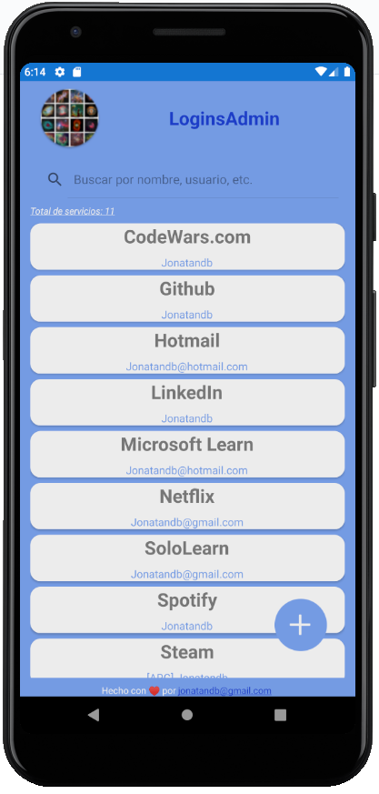

# LoginsAdmin

## Administrador de contraseñas gratuito para Android 

Realizado con Xamarin.Forms y C#

---

## Descarga e instalación de la última versión:
- <a href="https://github.com/Jonatandb/LoginsAdmin-Xamarin-/releases/tag/v0.8-alpha">v0.8-alpha: Rediseño de la grilla principal con mejoras en rendimiento general</a>

---	

### Pendientes y "Nice to have":

    - Corregir:
        - Centrar la contraseña a medida que es ingresada
            - https://forums.xamarin.com/discussion/42438/align-center-text-entry
            - https://stackoverflow.com/questions/50763662/center-text-in-xamarin-entry
        - Cuando se presiona el botón continuar más de una vez, la app no vuelve a pedir la contraseña al volver del segundo plano
        - Ver como mejorar el uso del flag para indicar que se ha salido de la aplicación para evitar mantenerlo en el codebehind de Login.xaml.cs
            - ¿Por qué se ejecuta de nuevo la App cada vez que se toca el ícono en lugar de traer al primer plano la instancia que ya se está ejecuntado?
        - Ver como evitar el manejador del evento ItemTapped de la grilla en el codebehind de Inicio.xaml.cs

    - Posibles agregados:
	    - Exportación/Importación de datos
            -   Que se soliciten las credenciales para algún servicio de almacenamiento online (DropBox, Drive, etc) y se guarde ahí un archivo con los datos de los servicios
            -   Que se genere y descargue un archivo XLS con contraseña: la utilizada para acceder a la aplicación.
                -   Contra: desde el celular no lo podrían abrir sin tener instalado Office.
            -   Que se genere y descargue un archivo .Zip con contraseña: la utilizada para acceder a la aplicación.
                -   Adentro podría tener un simple archivo txt, json, xls...
                -   Contra: desde el celular no lo podrían abrir y revisar ya que no se pueden abrir archivos .zip
	    - Que se pueda configurar:
            - Que se pueda elegir que la busqueda respete mayúsculas
		    - Reestablecer scroll de la grilla al agregar un servicio
		    - Si al estar creando un servicio se hace back y había algo escrito, que se pida confirmación para descartar los datos ingresados
		    - Que se pida confirmación al eliminar un servicio
	    - Que aparezca una imagen junto a cada fila con el favicon del servicio (si el mismo contiene una url)
            - https://www.google.com/s2/favicons?domain=www.google.com
	    - Cuando no exista el servicio buscado: Hacer aparecer texto clickeable que diga "Click aquí para crear el servicio + SearchText"
	    - Iconos juntos a los campos del ABM que permitan copiar al portapapeles los valores de tales campos
		    - https://docs.microsoft.com/en-us/xamarin/essentials/clipboard

    - Sugerencias recibidas:
        - Agregar opción que permita guardar contraseñas anteriores
        - Agregar menú con opción de auto-actualización
        - Que se pueda iniciar sesión con la huella digital

---

### Páginas consultadas:

 - <a href="https://docs.microsoft.com/es-es/learn/modules/create-a-mobile-app-with-xamarin-forms/2-create-a-xf-project-in-vs" target="_blank">Creación de un proyecto de Xamarin.Forms en Visual Studio</a>

 - <a href="https://docs.microsoft.com/es-es/learn/modules/store-local-data-with-sqlite/" target="_blank">Almacenamiento de datos locales con SQLite en una aplicación de Xamarin.Forms</a>

 - <a href="https://docs.microsoft.com/es-es/xamarin/android/user-interface/splash-screen" target="_blank">Pantalla de presentación</a>
 
 - <a href="https://docs.microsoft.com/es-es/learn/modules/create-multi-page-xamarin-forms-apps-with-stack-and-tab-navigation/" target="_blank">Creación de aplicaciones de Xamarin.Forms de varias páginas con navegación de pila y pestaña</a>
 
 - <a href="https://docs.microsoft.com/es-es/samples/xamarin/xamarin-forms-samples/navigation-loginflow/" target="_blank">Xamarin.Forms - LoginFlow</a>

 - <a href="https://channel9.msdn.com/Series/Xamarin-101" target="_blank">Xamarin Tutorial 101</a>

 - <a href="https://docs.microsoft.com/es-es/xamarin/xamarin-forms/user-interface/searchbar" target="_blank">SearchBar de Xamarin.Forms</a>

 - <a href="https://stackoverflow.com/questions/54517874/how-to-make-a-floating-action-button-in-xamarin-forms" target="_blank">Ícono flotante (FAB: Floating action button)</a>

 - <a href="https://favicon.io/favicon-generator/" target="_blank">Favicon generator</a>

 - <a href="https://docs.microsoft.com/es-es/xamarin/xamarin-forms/user-interface/layouts/absolute-layout" target="_blank">Xamarin.Forms AbsoluteLayout</a>

 - <a href="https://docs.microsoft.com/es-es/xamarin/xamarin-forms/app-fundamentals/data-binding/commanding#using-command-parameters" target="_blank">La interfaz de comandos de Xamarin.Forms</a>

 - <a href="https://geeks.ms/etomas/2011/09/17/c-5-async-await/" target="_blank">C# 5: Async / Await</a>

 - <a href="https://stackoverflow.com/questions/46332349/xamarin-button-command-inside-of-listview-itemtemplate-not-firing" target="_blank">Xamarin Button Command (inside of ListView.ItemTemplate) Not Firing</a>

 - <a href="https://docs.microsoft.com/es-es/xamarin/xamarin-forms/user-interface/layouts/stack-layout">Xamarin.Forms StackLayout</a>
 
 - <a href="https://docs.microsoft.com/es-es/xamarin/xamarin-forms/user-interface/webview?tabs=windows">Xamarin.Forms WebView</a>
 
 - <a href="https://docs.microsoft.com/es-es/learn/modules/display-collections-in-xamarin-forms-apps-with-listview/">Representación de colecciones en aplicaciones de Xamarin.Forms con ListView</a>
 
 - <a href="https://docs.microsoft.com/es-es/xamarin/xamarin-forms/app-fundamentals/custom-renderer/viewcell">Personalización de ViewCell</a>
 
 - <a href="https://docs.microsoft.com/en-us/dotnet/api/xamarin.forms.viewcell?view=xamarin-forms">ViewCell Class</a>
 
 - <a href="https://docs.microsoft.com/en-us/dotnet/api/xamarin.forms.cell?view=xamarin-forms">Cell Class</a>

 - <a href="https://docs.microsoft.com/es-es/xamarin/get-started/tutorials/pop-ups/?tabs=vswin">Tutorial sobre los elementos emergentes de Xamarin.Forms</a>

 - <a href="https://xamarinhelp.com/hyperlink-in-xamarin-forms-label/" target="_blank">Hyperlink in Xamarin.Forms Label</a>

 - <a href="https://xamarinhelp.com/xamarin-forms-user-control/" target="_blank">Xamarin Forms User Control</a>

 - <a href="https://css-tricks.com/snippets/html/mailto-links/" target="_blank">Mailto Links</a>

 - <a href="https://docs.microsoft.com/es-es/xamarin/get-started/tutorials/app-lifecycle/?tabs=vswin" target="_blank">Tutorial sobre el ciclo de vida de las aplicaciones de Xamarin.Forms</a>

 - <a href="https://docs.microsoft.com/es-es/xamarin/get-started/tutorials/label/?tabs=vswin">Tutorial sobre las etiquetas de Xamarin.Forms</a>

 - <a href="https://docs.microsoft.com/es-es/xamarin/get-started/tutorials/stacklayout/?tabs=vswin">Tutorial sobre el diseño de pila de Xamarin.Forms</a>

 - <a href="https://docs.microsoft.com/es-es/xamarin/xamarin-forms/user-interface/layouts/margin-and-padding">Margen y relleno</a>

 - <a href="https://docs.microsoft.com/es-es/xamarin/xamarin-forms/user-interface/layouts/layout-options">Opciones de diseño de Xamarin.Forms</a>

 - <a href="https://www.youtube.com/watch?v=pr03CYqhFr4&list=PLM75ZaNQS_FaEPpqVjfQdnFaSR1EWCeNZ&index=2&t=0s">Xamarin.Forms 101: Data Binding | The Xamarin Show</a>

 - <a href="https://forums.xamarin.com/discussion/11102/what-is-equivalent-to-getapplicationcontext-in-xamarin-android" target="_blank">What is equivalent to getApplicationContext() in Xamarin Android</a>

 - <a href="https://stackoverflow.com/questions/25885238/xamarin-forms-listview-set-the-highlight-color-of-a-tapped-item" target="_blank"> Xamarin.Forms ListView: Set the highlight color of a tapped item</a>

 - <a href="https://stackoverflow.com/questions/45767440/this-app-isnt-compatible-with-your-phone-android-7-0" target="_blank">“This app isn't compatible with your phone” Android 7.0</a>

 - <a href="https://www.youtube.com/watch?v=mqI6mMZTeVE&list=PLM75ZaNQS_FaEPpqVjfQdnFaSR1EWCeNZ&index=2" target="_blank">Xamarin.Forms 101: Commands | The Xamarin Show</a>

 - <a href="https://www.youtube.com/watch?v=4hYVgWI3APc&list=PLM75ZaNQS_FaEPpqVjfQdnFaSR1EWCeNZ&index=3" target="_blank">Xamarin.Forms 101: Commands Parameters | The Xamarin Show</a>

 - <a href="https://www.youtube.com/watch?v=ewctH8RyDiA&list=PLM75ZaNQS_FaEPpqVjfQdnFaSR1EWCeNZ&index=4" target="_blank">Xamarin.Forms 101: Control Reference Binding (View-to-View)</a>

 - <a href="https://www.youtube.com/watch?v=RvwMqYU-6qA&list=PLM75ZaNQS_FaEPpqVjfQdnFaSR1EWCeNZ&index=5" target="_blank">Xamarin.Forms 101: Application Resources</a>

 - <a href="https://stackoverflow.com/questions/44728008/how-to-autosize-the-height-of-a-list-view-in-xaml" target="_blank">How to autosize the height of a list view in XAML</a>

 - <a href="https://heartbeat.fritz.ai/techniques-for-improving-performance-in-a-xamarin-forms-application-b439f2f04156" target="_blank">Techniques for Improving Performance in a Xamarin.Forms Application</a>

 - <a href="https://stackoverflow.com/questions/52985095/xamarin-forms-editor-autosize-does-not-work" target="_blank">Xamarin forms Editor AutoSize does not work</a>

 - <a href="https://www.youtube.com/watch?v=GhWm3ccS_9U&list=PLM75ZaNQS_FaEPpqVjfQdnFaSR1EWCeNZ&index=6" target="_blank">Xamarin.Forms 101: Dynamic Resources</a>

 - <a href="https://www.youtube.com/watch?v=3DMCSJEwiR4&list=PLM75ZaNQS_FaEPpqVjfQdnFaSR1EWCeNZ&index=7" target="_blank">Xamarin.Forms 101: OnPlatform (Adjusting UI Based on Operating System)</a>

 - <a href="https://www.youtube.com/watch?v=ccU1a7CgxqI&list=PLM75ZaNQS_FaEPpqVjfQdnFaSR1EWCeNZ&index=8" target="_blank">Xamarin.Forms 101: OnIdiom (Adjusting UI Based on Device Type)</a>

 - <a href="https://www.youtube.com/watch?v=lwnDxQQs2Eo&list=PLM75ZaNQS_FaEPpqVjfQdnFaSR1EWCeNZ&index=9" target="_blank">Xamarin.Forms 101: XAML Previewer</a>

 - <a href="https://docs.microsoft.com/es-es/xamarin/xamarin-forms/user-interface/listview/performance" target="_blank">Rendimiento de ListView</a>

 - <a href="https://docs.microsoft.com/es-es/dotnet/api/xamarin.forms.listviewcachingstrategy?view=xamarin-forms" target="_blank">ListViewCachingStrategy Enumeración</a>

 - <a href="https://docs.microsoft.com/es-es/xamarin/xamarin-forms/user-interface/layouts/layout-compression" target="_blank">Compresión de diseño</a>

 - <a href="https://docs.microsoft.com/es-es/xamarin/xamarin-forms/internals/fast-renderers" target="_blank">Xamarin.Forms Fast Renderers</a>

 - <a href="https://docs.microsoft.com/en-us/dotnet/api/xamarin.forms.image.isopaque?view=xamarin-forms" target="_blank">Image.IsOpaque Property</a>

 - <a href="https://docs.microsoft.com/es-es/xamarin/android/app-fundamentals/resources-in-android/?tabs=windows" target="_blank">Android Resources</a>

 - <a href="https://stackoverflow.com/questions/37025546/what-does-load-resources-from-content-instead-of-resource-mean" target="_blank">What does load resources from Content instead of Resource mean?</a>

 - <a href="https://docs.microsoft.com/es-es/xamarin/android/user-interface/controls/web-view" target="_blank">Xamarin.Android Web View</a>

 - <a href="https://docs.microsoft.com/es-es/xamarin/xamarin-forms/user-interface/controls/" target="_blank">Controls Reference</a>

 - <a href="https://docs.microsoft.com/es-es/xamarin/xamarin-forms/user-interface/controls/pages" target="_blank">Xamarin.Forms Pages</a>

 - <a href="https://docs.microsoft.com/es-es/xamarin/xamarin-forms/user-interface/controls/layouts" target="_blank">Xamarin.Forms Layouts</a>

 - <a href="https://docs.microsoft.com/es-es/samples/xamarin/xamarin-forms-samples/formsgallery/" target="_blank">Xamarin.Forms - FormsGallery</a>

 - <a href="https://docs.microsoft.com/es-es/xamarin/xamarin-forms/user-interface/text/label" target="_blank">Etiqueta de Xamarin.Forms</a>

 - <a href="https://docs.microsoft.com/es-es/xamarin/xamarin-forms/user-interface/listview/customizing-cell-appearance" target="_blank">Personalizar la apariencia de una celda de ListView</a>

 - <a href="https://docs.microsoft.com/es-es/xamarin/xamarin-forms/user-interface/listview/" target="_blank">ListView de Xamarin.Forms</a>

 - <a href="https://docs.microsoft.com/es-es/xamarin/xamarin-forms/user-interface/layouts/choose-layout#absolutelayout" target="_blank">Elegir un diseño de Xamarin. Forms</a>

 - <a href="https://www.youtube.com/watch?v=q7yl95pSjo0&list=PLM75ZaNQS_FaEPpqVjfQdnFaSR1EWCeNZ&index=11" target="_blank">Xamarin.Forms 101: Getting to Know your XAML Workspace - Visual Studio 2019 for Windows</a>

 - <a href="https://www.youtube.com/watch?v=iqLt5GhDwY0&list=PLM75ZaNQS_FaEPpqVjfQdnFaSR1EWCeNZ&index=13" target="_blank">Xamarin.Forms 101: Styles</a>

 - <a href="https://www.youtube.com/watch?v=q4EYysAgA9E&list=PLM75ZaNQS_FaEPpqVjfQdnFaSR1EWCeNZ&index=14" target="_blank">Xamarin.Forms 101: Compiled Bindings</a>

 - <a href="https://stackoverflow.com/questions/42176182/xamarin-forms-set-focus-from-mvvm-viewmodel" target="_blank">Xamarin.Forms set focus from mvvm ViewModel</a> - <a href="https://chat.stackoverflow.com/rooms/135587/discussion-between-paul-karam-and-atlantis" target="_blank">(Chat)</a>

 - <a href="https://channel9.msdn.com/Series/Windows-Phone-8-1-Development-for-Absolute-Beginners/Part-24-Binding-to-Commands-and-CommandParameters" target="_blank">Part 24 - Binding to Commands and CommandParameters</a>

 - <a href="https://www.youtube.com/watch?v=Wd6ssAIdR30" target="_blank">Command in Xamarin.Forms</a>

 - <a href="https://stackoverflow.com/questions/51877087/passing-button-value-as-command-parameter" target="_blank">Passing button value as command parameter</a>

 - <a href="https://github.com/xamarin/Xamarin.Forms/issues/8918#issuecomment-570693886" target="_blank">[Bug] [UWP] Template Disappears when Command Parameter Binding Set #8918</a>

 - <a href="https://stackoverflow.com/questions/32206200/how-to-set-focus-from-viewmodel-in-xamarin-forms" target="_blank">How to set focus from ViewModel in Xamarin Forms</a>

 - <a href="https://docs.microsoft.com/en-us/xamarin/xamarin-forms/app-fundamentals/data-binding/" target="_blank">Xamarin.Forms Data Binding</a>

 - <a href="https://docs.microsoft.com/es-es/samples/xamarin/xamarin-forms-samples/databindingdemos/" target="_blank">Xamarin.Forms - Data Binding Demos</a>

 - <a href="https://docs.microsoft.com/en-us/xamarin/xamarin-forms/app-fundamentals/data-binding/commanding" target="_blank">The Xamarin.Forms Command Interface</a>

 - <a href="https://docs.microsoft.com/en-us/xamarin/xamarin-forms/creating-mobile-apps-xamarin-forms/summaries/chapter18" target="_blank">Summary of Chapter 18. MVVM</a>

 - <a href="https://docs.microsoft.com/en-us/xamarin/xamarin-forms/xaml/xamlc" target="_blank">XAML Compilation in Xamarin.Forms</a>

 - <a href="https://docs.microsoft.com/en-us/xamarin/xamarin-forms/app-fundamentals/data-binding/compiled-bindings" target="_blank">Xamarin.Forms Compiled Bindings</a>

 - <a href="https://docs.microsoft.com/en-us/dotnet/api/system.threading.tasks.task.delay?view=netframework-4.8" target="_blank">Task.Delay Method</a>

 - <a href="https://docs.microsoft.com/es-es/xamarin/xamarin-forms/app-fundamentals/triggers" target="_blank">Desencadenadores de Xamarin.Forms</a>

 - <a href="https://docs.microsoft.com/es-es/xamarin/xamarin-forms/app-fundamentals/behaviors/introduction" target="_blank">Introducción a los comportamientos</a>

 - <a href="https://docs.microsoft.com/es-es/xamarin/xamarin-forms/user-interface/controls/common-properties" target="_blank">Propiedades, métodos y eventos de controles comunes de Xamarin. Forms</a>

 - <a href="https://stackoverflow.com/questions/40155726/xamarin-set-focus-mvvm" target="_blank">Xamarin set focus MVVM</a>

 - <a href="https://forums.xamarin.com/discussion/79598/how-set-focus-a-entry-from-viewmodel-level" target="_blank">How set focus a entry from viewModel level?</a>

 - <a href="https://stackoverflow.com/questions/28194231/automatically-select-all-text-on-focus-xamarin" target="_blank">Automatically select all text on focus Xamarin</a>

 - <a href="https://forums.xamarin.com/discussion/99348/space-between-listview-cards" target="_blank">Space between Listview cards</a>

 - <a href="https://stackoverflow.com/questions/25885238/xamarin-forms-listview-set-the-highlight-color-of-a-tapped-item/53079812#53079812" target="_blank">Xamarin.Forms ListView: Set the highlight color of a tapped item</a>

 - <a href="https://stackoverflow.com/questions/53078214/xamarin-forms-listview-rounded-corner-cell-highlight-grayout" target="_blank">Xamarin Forms Listview Rounded Corner Cell highlight grayout</a>

 - <a href="https://stackoverflow.com/questions/41186660/xamarin-forms-stacklayout-with-rounded-corners" target="_blank">Xamarin Forms: StackLayout with rounded corners</a>

 - <a href="https://www.youtube.com/watch?v=mJpwudNNe_M&list=PLM75ZaNQS_FaEPpqVjfQdnFaSR1EWCeNZ&index=15" target="_blank">Xamarin.Forms 101: Entries and Editors</a>

 - <a href="https://www.youtube.com/watch?v=oah-Q1kPOyI&list=PLM75ZaNQS_FaEPpqVjfQdnFaSR1EWCeNZ&index=16" target="_blank">Xamarin.Forms 101: Control Templates</a>

 - <a href="https://www.youtube.com/watch?v=VVpbklb6vDc&list=PLM75ZaNQS_FaEPpqVjfQdnFaSR1EWCeNZ&index=17" target="_blank">Xamarin.Forms 101: Using Embedded Images</a>

---

### Otras pruebas:
- Cree un almacén de claves AdHoc Android de prueba, pero después lo borré, tenía estos datos:
  - Alias:		Jonatandb
  - Contraseña:	loginsadmin
  - Nombre:		Jonatandb@gmail.com
  - Validez:	30 años
   - Ruta de keys:	C:\Users\Jonatandb\AppData\Local\Xamarin\Mono for Android
   - Ruta de apks generados: C:\Users\Jonatandb\AppData\Local\Xamarin\Mono for Android\Archives\2020-03-29\LoginsAdmin.Android 3-29-20 1.06 AM.apkarchive
  - ** Lo borré porque lo usé para generar el apk desde el Archive Manager, pero el apk generado, aunque lo firmé, no se instaló en el dispositivo, tiró error de "Aplicación no instalada" y nada más.
   - Investigar, puede que el error no haya estado relacionado con esto al 100%...

- Encontré varias formas de establecerle el foco a un control desde el ViewModel (utilicé la propiedad CommandParameter):
  - 1 - Usar:
    - var txtNewPassword = (Entry) App.Current.MainPage.Navigation.NavigationStack[0].FindByName("txtNewPassword");
    - txtNewPassword.Focus();
  - 2 - Usar: 
    - // Esto requiere que previamente, en el codebehind, se cree una property pública que exponga el control txtPassword.
    - var txtNewPassword = (Entry) ((Page) App.Current.MainPage.Navigation.NavigationStack[0]).TxtPassword;
    - txtNewPassword.Focus();
  - 3 - Usar una propiedad en el ViewModel que sea del tipo del control a manipular, luego que la vista instancie el ViewModel desde el codebehind y por último asigne a esa propiedad la referencia del control que se va a manipular desde el ViewModel.
  - 4 - Finalmente utilicé la propiedad CommandParameter a la cual le pasé una referencia del control (CommandParameter={x:Reference txtPassword}}) y desde el ViewModel utilicé la sobrecarga del constructor de Command<Entry> para que se reciba el control como parámetro.